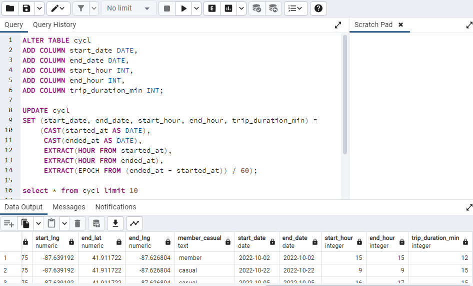

## About the company
**Cyclistic:** A bike-share program that features more than **5,800** bicycles and **600** docking stations. **Cyclistic** sets itself apart by also offering reclining bikes, hand tricycles, and cargo bikes, making bike-share more inclusive to people with disabilities and riders who can't use a standard two-wheeled bike. The majority of riders opt for traditional bikes; about **8%** of riders use the assistive options. **Cyclistic** users are more likely to ride for leisure, but about **30%** use them to commute to work each day.

Customers who purchase single-ride or full-day passes are referred to as **casual riders**. Customers who purchase annual memberships are **Cyclistic members**. **Cyclistic's** finance analysts have concluded that **annual members** are much more profitable than casual riders.

**Moreno** (Director of Marketing) has set a **clear goal**: Design marketing strategies aimed at converting **casual riders** into **annual members**. In order to do that, however, the marketing analyst team needs to better understand how **annual members** and **casual riders** differ, why **casual riders** would buy a **membership**, and how digital media could affect their marketing tactics. **Moreno** and her team are interested in analyzing the **Cyclistic** historical bike trip **data** to identify **trends**.


## About the task
### Business goal
aiming to increase the number of annual memberships and covert casual riders into annual members.  


### Business task
How do annual members and casual riders use Cyclistic bikes differently?


### Stakeholders
**Primary stakeholders: **Lily Moreno  
**secondary stakeholders: **Cyclistic executive team

## about the data  
- the data is located in a source [url](https://divvy-tripdata.s3.amazonaws.com/index.html), provided by Motivate International Inc.  
- The files are listed in chronological order, starting from the earliest available data.  
- The data files are organized per month for the year 2022. Each file contains data for one month. The file naming convention follows the pattern "YYYYMM-divvy-tripdata.csv", where "YYYY" represents the four-digit year and "MM" represents the two-digit month.
- the data file "202201-divvy-tripdata.csv" contains data for January 2022, "202202-divvy-tripdata.csv" contains data for February 2022, and so on.
- The organization of the data allows for easy identification and retrieval of trip data based on the desired time period.  
- the data is protected under this [license](https://ride.divvybikes.com/data-license-agreement)  
- this data-privacy issues prohibit you from using riders’ personally identifiable information. This means that you won’t be able to connect pass purchases to credit card numbers to determine if casual riders live in the **Cyclistic** service area or if they have purchased multiple single passes. 

## Data description

loading libraries

```r
library(tidyverse)
```

```
## ── Attaching core tidyverse packages ────────────────────────────────────── tidyverse 2.0.0 ──
## ✔ dplyr     1.1.2     ✔ readr     2.1.4
## ✔ forcats   1.0.0     ✔ stringr   1.5.0
## ✔ ggplot2   3.4.2     ✔ tibble    3.2.1
## ✔ lubridate 1.9.2     ✔ tidyr     1.3.0
## ✔ purrr     1.0.1     
## ── Conflicts ──────────────────────────────────────────────────────── tidyverse_conflicts() ──
## ✖ dplyr::filter() masks stats::filter()
## ✖ dplyr::lag()    masks stats::lag()
## ℹ Use the conflicted package (<http://conflicted.r-lib.org/>) to force all conflicts to become errors
```

```r
library(skimr)
library(janitor)
```

```
## 
## Attaching package: 'janitor'
## 
## The following objects are masked from 'package:stats':
## 
##     chisq.test, fisher.test
```

```r
library(lubridate)
```
The data files contain 13 columns each. The column names are as follows:

```r
trips_data <- read_csv("C:/Users/isach/OneDrive/Bureau/projects/dataset/202207-divvy-tripdata.csv")
```

```
## Rows: 823488 Columns: 13
## ── Column specification ──────────────────────────────────────────────────────────────────────
## Delimiter: ","
## chr (9): ride_id, rideable_type, started_at, ended_at, start_station_name, start_station_i...
## dbl (4): start_lat, start_lng, end_lat, end_lng
## 
## ℹ Use `spec()` to retrieve the full column specification for this data.
## ℹ Specify the column types or set `show_col_types = FALSE` to quiet this message.
```
- 9 of these variables are categorical.   
- The other 4 variables are quantitative.
- Some of the files contain missing values in the columns for start_station_name, start_station_id, end_station_name, and end_station_id. However, latitude and longitude data are still present, which provides location information for the corresponding stations.

## cleaning the data
### tools used
**SQL:** To process and clean the data.  
**R :** To analyse and visualize the data.

### **using R**

### Cleaning
**Merging the data frames**
To simplify the process, I merged the separate data frames into one using R. This allows me to easily work with and analyze the combined dataset.

```r
#Setting the Data File Folder Path
folder_path <- "C:/Users/isach/OneDrive/Bureau/projects/dataset"

#create a list to store the data frames we will be working with.
data_frames <- list()

# Get a list of all files in the folder
file_list <- list.files(path = folder_path, full.names = TRUE)

# Iterate through the files and import them into individual data frames
for (file in file_list) {
  df <- read.csv(file)
  
  # Rename columns to ensure consistency
  colnames(df) <- c(
    "ride_id", "rideable_type", "started_at", "ended_at", "start_station_name", 
    "start_station_id", "end_station_name", "end_station_id", "start_lat", 
    "start_lng", "end_lat", "end_lng", "member_casual"
    )
  data_frames[[file]] <- df
}

#Combine the individual data frames into one data frame
combined_cyclistic <- do.call(rbind, data_frames)

#saving our combined table
write.csv(combined_cyclistic, file = "combined_cyclistic.csv", row.names = FALSE)
```
Now we have **13 columns** and **5,745,753 total rows**  

#### removing bike_id column

```r
data_ride_id_removed <- select(combined_cyclistic, -ride_id)
colnames(data_ride_id_removed)
```

```
##  [1] "rideable_type"      "started_at"         "ended_at"           "start_station_name"
##  [5] "start_station_id"   "end_station_name"   "end_station_id"     "start_lat"         
##  [9] "start_lng"          "end_lat"            "end_lng"            "member_casual"
```

### Cleaning the stations names

To handle missing station names, we will use the latitude and longitude coordinates to infer the names of the stations. By analyzing the geographical information, we can estimate the station names for the missing data points.   However, since we don't have access to the main database and the reverse geocoding method is not accurate, we will instead choose to remove the rows that have missing data. This way, we can ensure that the missing data doesn't interfere with our analysis.

#### Cleaning station names in R
Removing rows were start_station_name, end_station_name have blank cells.  


```r
clean_names_start <- filter(data_ride_id_removed, 
                       data_ride_id_removed$start_station_name != "")
```
repeating the same thing for end_station_name.  

### **Using SQL**
I used SQL to clean the dates in our dataset and calculated the trip duration in minutes.
).  

**Notice that we have values that are less than 0 in the trip_duration_min column ?**  

  

Let's fix that !!  


Let's now check.  


Now that our data is ready, let's make one final modification before proceeding.  

### Cleaning columns names  


  

## Analysing and Visualizing the data    


i added new columns to our data frame using **SQL**.  


Importing our new data frame.  

```r
bikeshare <- read_csv('C:/Users/isach/OneDrive/Bureau/projects/bikeshare.csv')
```

```
## Rows: 4437128 Columns: 20
## ── Column specification ──────────────────────────────────────────────────────────────────────
## Delimiter: ","
## chr  (8): bike_type, start_station_name, start_station_id, end_station_name, end_station_i...
## dbl  (8): start_lat, start_lng, end_lat, end_lng, start_hour, end_hour, trip_duration_min,...
## dttm (2): started_at, ended_at
## date (2): start_date, end_date
## 
## ℹ Use `spec()` to retrieve the full column specification for this data.
## ℹ Specify the column types or set `show_col_types = FALSE` to quiet this message.
```

Taking a glimpse at our new data frame.  

```r
glimpse(bikeshare)
```

```
## Rows: 4,437,128
## Columns: 20
## $ bike_type          <chr> "classic bike", "electric bike", "electric bike", "classic bike",…
## $ started_at         <dttm> 2022-07-21 20:53:29, 2022-07-12 12:45:02, 2022-07-31 16:09:30, 2…
## $ ended_at           <dttm> 2022-07-21 21:01:30, 2022-07-12 12:52:12, 2022-07-31 16:18:04, 2…
## $ start_station_name <chr> "Clark St & Newport St", "Kingsbury St & Kinzie St", "Kingsbury S…
## $ start_station_id   <chr> "632", "KA1503000043", "KA1503000043", "KA1503000043", "KA1503000…
## $ end_station_name   <chr> "Clark St & Montrose Ave", "Halsted St & Willow St", "State St & …
## $ end_station_id     <chr> "KA1503000022", "TA1307000166", "21544", "21544", "TA1307000166",…
## $ start_lat          <dbl> 41.94454, 41.88911, 41.88906, 41.88918, 41.88918, 41.88918, 41.91…
## $ start_lng          <dbl> -87.65468, -87.63827, -87.63855, -87.63851, -87.63851, -87.63851,…
## $ end_lat            <dbl> 41.96159, 41.91387, 41.89662, 41.89662, 41.91387, 41.89662, 41.91…
## $ end_lng            <dbl> -87.66604, -87.64875, -87.62858, -87.62858, -87.64875, -87.62858,…
## $ user_type          <chr> "casual", "member", "casual", "casual", "member", "member", "memb…
## $ start_date         <date> 2022-07-21, 2022-07-12, 2022-07-31, 2022-07-17, 2022-07-12, 2022…
## $ end_date           <date> 2022-07-21, 2022-07-12, 2022-07-31, 2022-07-17, 2022-07-12, 2022…
## $ start_hour         <dbl> 21, 13, 17, 6, 7, 0, 10, 6, 19, 8, 20, 20, 19, 17, 18, 0, 19, 22,…
## $ end_hour           <dbl> 22, 13, 17, 6, 7, 0, 10, 6, 19, 13, 20, 20, 19, 17, 18, 0, 19, 22…
## $ trip_duration_min  <dbl> 8, 7, 9, 8, 12, 6, 27, 1, 1, 303, 1, 28, 15, 1, 5, 1, 4, 1, 8, 20…
## $ month              <chr> "july", "july", "july", "july", "july", "july", "july", "july", "…
## $ season             <chr> "summer", "summer", "summer", "summer", "summer", "summer", "summ…
## $ year               <dbl> 2022, 2022, 2022, 2022, 2022, 2022, 2022, 2022, 2022, 2022, 2022,…
```

### basic descriptive analysis  

```r
basic_stats <- bikeshare %>%
  select(user_type, trip_duration_min) %>%
  group_by(user_type) %>%
  summarize( 
          'min_trip_duration_mins' = min(trip_duration_min),
          'max_trip_duration_mins' = max(trip_duration_min),
          'mean_trip_duration_mins' = mean(trip_duration_min),
          trips_more_than_24h = sum(trip_duration_min >= 1440))
```


**N.B: casual users take longer trips than the annual members.**  

#### Visualizing the user type distribution  

```r
plot_1 <- ggplot(data = bikeshare, mapping = aes(x=user_type, fill = user_type))+ 
  geom_bar()+
  labs(title = 'User Type Distribution',
       x = 'user type')
plot_1
```


**N.B: The number of annual members exceeds the number of casual users.**    

#### Visualizing the average trip duration by user types  

```r
plot_2 <- ggplot(data = basic_stats)+
  geom_col(mapping = aes(x = user_type, y= mean_trip_duration_mins, fill = user_type))+
  labs(title = 'average trip duration by the different user types',
       x = 'user_type',
       y = 'avg_trip_duration_min')
plot_2
```


**N.B: casual users travel longer than the annual members**  

#### Visualizing user type distribution across weekdays using a line chart  

```r
weekly_count <- bikeshare %>% 
  group_by(week_days = wday(start_date, label = TRUE), user_type) %>% 
  summarize(number_of_trips = n(), .groups = "drop")

plot_3 <- ggplot(data = weekly_count) +
  geom_line(mapping = aes(x = week_days, y = number_of_trips, color = user_type,
                          group = user_type), size = 0.8) +
  labs(title = 'Number of trips by User Types Throughout the Week',
       x = 'Week days',
       y = 'Number of trips made')
```

```
## Warning: Using `size` aesthetic for lines was deprecated in ggplot2 3.4.0.
## ℹ Please use `linewidth` instead.
## This warning is displayed once every 8 hours.
## Call `lifecycle::last_lifecycle_warnings()` to see where this warning was generated.
```

```r
plot_3
```


#### Visualizing user type distribution across weekdays  

```r
plot_4 <- ggplot(data = weekly_count)+
  geom_col(mapping = aes(x= week_days, y= number_of_trips, fill = user_type), 
           position = "dodge", size = 0.4)+
  labs(title = 'Number of trips by User Types Throughout the Week',
       x= 'week days',
       y= 'number of trips made')
plot_4
```


**N.B:** 
- Weekdays: Annual members consistently have higher trip counts than casual users.
- Friday: Casual user trips surpass annual members, indicating increased activity, while annual members decrease.
- Saturday: Peak day for casual users with the highest trip counts, declining on Sunday. Annual members show the opposite trend.  

#### Visualizing the monthly user type distribution  

```r
trips_per_month <- bikeshare %>% 
  group_by(month = month(start_date, label = TRUE), user_type) %>% 
  summarize(number_of_trips = n(), .groups = 'drop')

plot_5 <- ggplot(data = trips_per_month)+
  geom_col(mapping = aes(x= month, y=number_of_trips, fill = user_type),
           position = 'dodge')+
  labs(title = 'Number of trips by User Types Throughout the year',
       x= 'months',
       y= 'number of trips made')
plot_5
```


**N.B: **
Annual members uses Cyclistic services more frequently compared to casual users. However, an interesting pattern emerged during the spring months (March, April, May) where the number of casual members started to increase. This increase continued into the summer months, resulting in a similar level of bike rentals for both annual and casual members. However, as autumn arrived (September, October, November), the number of casual user rentals began to decrease once again. This indicates a seasonal fluctuation in the usage patterns, with casual users showing a notable increase during spring and summer, but declining in autumn and winter.  

#### visualizing the diffrent types of bikes throughout the seasons  

```r
bikes <- bikeshare %>%
  group_by(season, bike_type) %>%
  summarise(number_bikes_used = n(), .groups = 'drop')

plot_6 <- ggplot(data = bikes)+
  geom_col(mapping = aes(x= season, y=number_bikes_used, fill = bike_type),
           position = 'dodge')+
  labs(title = 'Number of bikes used throughout the seasons by diffrent bike types',
       x= 'seasons',
       y= 'number of bikes used')
plot_6
```


#### top 10 pick_up locations  

  

#### top 10 trips  

  

#### Vsualizing the diffrent types of bikes by user types  

```r
bike_types <- bikeshare %>% 
  select(user_type, bike_type) %>% 
  group_by(bike_type, user_type) %>% 
  summarize(count_of_bikes = n(), .groups = 'drop')

ggplot(data = bike_types) + 
  geom_col(mapping = aes(x = bike_type, y = count_of_bikes,
                         fill = user_type), position = "dodge") + 
  labs(title = "Choice of Bikes", 
       subtitle = "choice of bike types between rider types", 
       x = "type of bikes", 
       y = "number of rider types using bike")
```


**N.B: casual riders uses all types of bikes. annual members prefer classic bikes. classic bikes are the most popular between the 3 types.**    

## Conclusion  

Our goal was to discover how do annual members and casual riders use Cyclistic bikes differently? By looking at the previous 12 months of Cyclistic trip data, we're able to find out that :  

- Annual members use Cyclistic bikes more often than casual users.  
- casual users **travel longer** than the annual members.  
- casual users are likely to use cyclistic services at **holidays** while annual members are likely to use cyclistic services **troughout the week**.  
- During **spring** and **summer**, casual users start renting bikes in **larger numbers**, reaching a similar level as annual members. In **autumn**, casual user rentals **decrease** again.  
- The usage of Cyclistic bikes varies with the seasons, with casual users renting **more bikes** during **warmer months** (spring, summer) but **fewer bikes** in **autumn** and **winter**.  
- Classic bikes are **the most popular bikes** in all the seasons.
- Electric bikes are **most popular** in **summer**.  


## Recommendations  
Since our **gaol** is to **increase** the number of annual memberships and **covert** casual riders into annual members. We can:  

- Collaborate with social media influencers to promote and use our bikes.  
- Offer exclusive discounts, rewards, or incentives for annual members to encourage new sign-ups and retain existing members.  
- Plan affordable bike trips to tourist spots, providing an exciting opportunity for annual members to explore and enjoy.  
- Introduce a program where current annual members can get rewards or discounts by inviting casual riders to become annual members.  
- Utilize targeted online advertising campaigns to reach potential annual members, focusing on the unique advantages and features of our bike-share service.  
